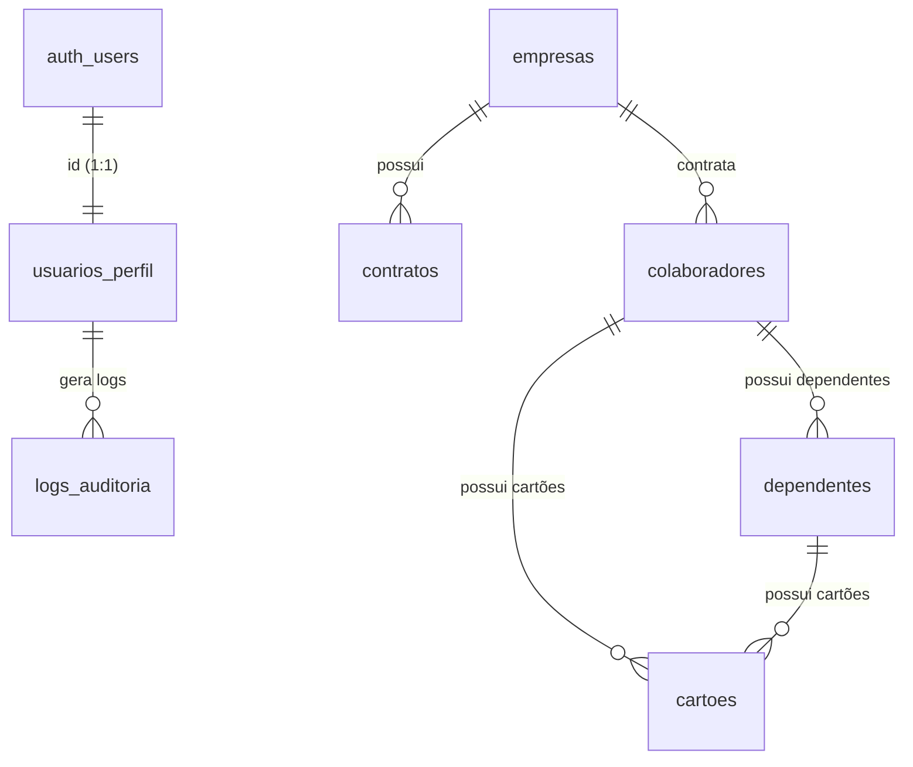

# 🛡️ OmniCard - Gestão Unificada de Cartões e Colaboradores

> Sistema corporativo premium para gestão de benefícios, cartões corporativos, controle de empresas, contratos e colaboradores. Conta com uma arquitetura moderna integrando React, TypeScript, Supabase e Deno Edge Functions.

---

## 🖥️ Mockup do Sistema

### 📊 Visão Geral do Dashboard
```
+-----------------------------------------------------------------------------------+
|  [🛡️ OMNICARD]  Portal de Benefícios & Cartões              [👤 Carlos Silva (Admin)]  |
+-----------------------------------------------------------------------------------+
|  | 📊 Dashboard    |                                                              |
|  | 🏢 Empresas     |  EMPRESAS ATIVAS      CONTRATOS A VENCER     CARTÕES EMITIDOS |
|  | 👥 Colaboradores|     [ 12 ]                [ 3 ]                  [ 142 ]      |
|  | 💳 Cartões      |                                                              |
|  | 📝 Auditoria    |  Estatísticas Globais & Alertas de Contratos                |
|  +-----------------+  +--------------------------------------------------------+  |
|                       |  ⚠️ Alerta: 2 contratos expiram nos próximos 30 dias.   |  |
|                       +--------------------------------------------------------+  |
|                       |  📈 Volume Transacionado por Categoria                 |  |
|                       |  [■■■■■■■■■■■■■■■■ 72% Alimentação]                     |  |
|                       |  [■■■■■■ 28% Mobilidade]                               |  |
|                       +--------------------------------------------------------+  |
+-----------------------------------------------------------------------------------+
```

---

## 🎯 Principais Funcionalidades

*   **📊 Dashboard Inteligente**: Indicadores agregados em tempo real de empresas ativas, contratos a vencer, cartões ativos/bloqueados e alertas críticos de conformidade.
*   **🏢 Gestão de Empresas e Contratos**: Cadastro completo e fluxo automatizado de alteração de status de vigência de contratos corporativos (vigente, a vencer, vencido).
*   **👥 Gestão de Colaboradores & Dependentes**: Cadastro com validações rigorosas (como consistência de CPF), e exclusão lógica com efeito cascata (inativação automática de dependentes e cartões atrelados).
*   **💳 Controle de Emissão de Cartões**: Criação de cartões de benefícios baseados em layout e regras de negócio com suporte a reemissão e bloqueio temporário.
*   **📝 Triggers de Auditoria Integrados**: Todo evento crítico do banco (inserção, atualização, deleção) gera automaticamente um snapshot detalhado nos logs de auditoria contendo dados de `antes` e `depois`.
*   **⚡ Edge Functions**: Processamento assíncrono e integrado via Deno para importação em lote de colaboradores, geração dinâmica de cartões em PDF e agregação de indicadores.

---

## 🛠️ Stack Tecnológica

*   **Frontend**: React 19, TypeScript, Vite, Lucide Icons.
*   **Banco de Dados & Backend**: Supabase (PostgreSQL) com RLS (Row Level Security), Triggers PL/pgSQL e Extensões (`uuid-ossp`, `pg_cron`).
*   **Edge Computing**: Deno (Supabase Edge Functions).
*   **Segurança (MFA)**: Fluxo de autenticação em duas etapas (2FA/MFA) por e-mail/OTP simulado.

---

## 💾 Arquitetura do Banco de Dados (PostgreSQL)

O banco de dados do Supabase é regido pelas seguintes tabelas e regras estruturadas no [schema.sql](file:///home/frederico/react-project/controle/supabase/schema.sql):



### Principais Triggers PL/pgSQL
1.  **`trg_on_auth_user_created`**: Cria automaticamente o perfil do usuário na tabela `public.usuarios_perfil` após o cadastro no Supabase Auth.
2.  **`executeAuditTrigger`**: Rastreia alterações críticas em colaboradores, contratos e cartões, gravando o histórico em `logs_auditoria`.
3.  **`executeInactivationTrigger`**: Executa a inativação em cascata (desativa dependentes e bloqueia cartões associados) quando um colaborador é inativado.

---

## ⚙️ Modo de Simulação vs. Banco de Dados Real

O projeto possui um **Simulador Cliente-Side** embutido ([supabaseSimulator.ts](file:///home/frederico/react-project/controle/src/lib/supabaseSimulator.ts)) que permite o funcionamento completo da aplicação (inclusive de triggers, RLS e Edge Functions via `localStorage`) sem necessidade de conexão ativa com o banco.

### Como conectar ao seu projeto Supabase Real
Para sair do modo de simulação e utilizar o banco de dados PostgreSQL rodando em nuvem:

1.  Crie um arquivo `.env.local` na raiz do projeto.
2.  Adicione as credenciais obtidas no painel do Supabase:
    ```env
    VITE_SUPABASE_URL=https://seu-projeto-id.supabase.co
    VITE_SUPABASE_ANON_KEY=sua-chave-publica-anonima-aqui
    ```
3.  Reinicie o servidor de desenvolvimento.

---

## 🚀 Como Executar o Projeto Localmente

### Pré-requisitos
*   **Node.js** (v18 ou superior)
*   **NPM** ou gerenciador de pacotes equivalente

### Passos de Inicialização
1.  **Instale as dependências**:
    ```bash
    npm install
    ```
2.  **Rode o servidor de desenvolvimento**:
    ```bash
    npm run dev
    ```
3.  **Para formatar e inspecionar erros de código (Linter)**:
    ```bash
    npm run lint
    ```

---

## 📝 Licença

Este projeto está licenciado sob a licença MIT. Para mais detalhes, consulte o arquivo LICENSE.
